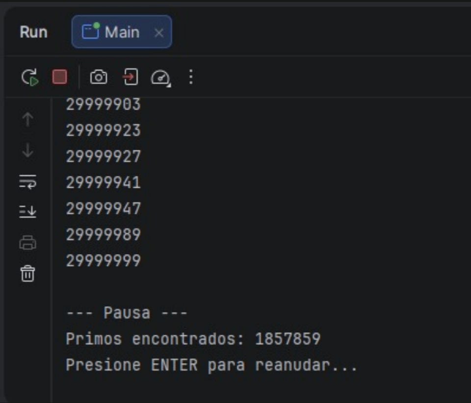

# Snake Race — ARSW Lab #2 (Java 21, Virtual Threads)

**Escuela Colombiana de Ingeniería – Arquitecturas de Software**  
Laboratorio de programación concurrente: condiciones de carrera, sincronización y colecciones seguras.

---

## Requisitos

- **JDK 21** (Temurin recomendado)
- **Maven 3.9+**
- SO: Windows, macOS o Linux

---

## Cómo ejecutar

```bash
mvn clean verify
mvn -q -DskipTests exec:java -Dsnakes=4
```

- `-Dsnakes=N` → inicia el juego con **N** serpientes (por defecto 2).
- **Controles**:
  - **Flechas**: serpiente **0** (Jugador 1).
  - **WASD**: serpiente **1** (si existe).
  - **Espacio** o botón **Action**: Pausar / Reanudar.

---

## Reglas del juego (resumen)

- **N serpientes** corren de forma autónoma (cada una en su propio hilo).
- **Ratones**: al comer uno, la serpiente **crece** y aparece un **nuevo obstáculo**.
- **Obstáculos**: si la cabeza entra en un obstáculo hay **rebote**.
- **Teletransportadores** (flechas rojas): entrar por uno te **saca por su par**.
- **Rayos (Turbo)**: al pisarlos, la serpiente obtiene **velocidad aumentada** temporal.
- Movimiento con **wrap-around** (el tablero “se repite” en los bordes).

---

## Arquitectura (carpetas)

```
co.eci.snake
├─ app/                 # Bootstrap de la aplicación (Main)
├─ core/                # Dominio: Board, Snake, Direction, Position
├─ core/engine/         # GameClock (ticks, Pausa/Reanudar)
├─ concurrency/         # SnakeRunner (lógica por serpiente con virtual threads)
└─ ui/legacy/           # UI estilo legado (Swing) con grilla y botón Action
```

---

# Actividades del laboratorio

## Parte I — (Calentamiento) `wait/notify` en un programa multi-hilo

1. Toma el programa [**PrimeFinder**](https://github.com/ARSW-ECI/wait-notify-excercise).
2. Modifícalo para que **cada _t_ milisegundos**:
   - Se **pausen** todos los hilos trabajadores.
   - Se **muestre** cuántos números primos se han encontrado.
   - El programa **espere ENTER** para **reanudar**.
3. La sincronización debe usar **`synchronized`**, **`wait()`**, **`notify()` / `notifyAll()`** sobre el **mismo monitor** (sin _busy-waiting_).
4. Entrega en el reporte de laboratorio **las observaciones y/o comentarios** explicando tu diseño de sincronización (qué lock, qué condición, cómo evitas _lost wakeups_).

> Objetivo didáctico: practicar suspensión/continuación **sin** espera activa y consolidar el modelo de monitores en Java.

## Solución
- Usé un solo “candado” (monitor) para coordinar a todos los hilos.
- Cuando toca pausar, marco una bandera paused = true.
- Cada hilo revisa esa bandera; si está en pausa, se duerme con wait() sin gastar CPU.
- Para reanudar, pongo paused = false y llamo notifyAll() para despertar a todos.
- No hay “lost wakeups” porque la condición se revisa dentro de un while bajo el mismo synchronized.



---

## Parte II — SnakeRace concurrente (núcleo del laboratorio)

### 1) Análisis de concurrencia

- Explica **cómo** el código usa hilos para dar autonomía a cada serpiente.
- **Identifica** y documenta en **`el reporte de laboratorio`**:
  - Posibles **condiciones de carrera**.
  - **Colecciones** o estructuras **no seguras** en contexto concurrente.
  - Ocurrencias de **espera activa** (busy-wait) o de sincronización innecesaria.

### Solución

El juego usa un hilo virtual por serpiente. En la UI se crea un SnakeRunner por cada serpiente y se ejecuta con un Executor de virtual threads, así cada serpiente avanza de forma autónoma. El repintado de la UI se hace con un reloj (GameClock) que dispara ticks periódicos y llama a repaint en el hilo de Swing. Ver SnakeApp.java:48-52 y SnakeRunner.java:21-34.

Hay posibles condiciones de carrera en el cuerpo de la serpiente: el hilo de la serpiente modifica el ArrayDeque en advance(...) mientras la UI hace snapshot() para pintar. Como no hay sincronización, pueden aparecer lecturas inconsistentes. Ver Snake.java:7-40 y SnakeApp.java:212-226. La dirección sí es volatile, por lo que los cambios de turn(...) tienen visibilidad entre hilos. Ver Snake.java:8-29.

En cuanto a colecciones no seguras, el cuerpo de la serpiente usa ArrayDeque, que no es thread-safe y se comparte entre hilos (serpiente y UI). También la lista de serpientes es un ArrayList; en el código actual no se modifica tras construirse, pero no sería segura si se modificara concurrentemente. Ver Snake.java:7-39 y SnakeApp.java:23-37.

No se observa espera activa (busy-wait): cada serpiente duerme con Thread.sleep(...), y el reloj usa un ScheduledExecutorService para los ticks. Ver SnakeRunner.java:32-34 y GameClock.java:23-27. El tablero usa sincronización en step(...) y en los getters para proteger sus colecciones internas; esto evita carreras pero bloquea todo el método (región crítica amplia). Ver Board.java:34-67.

### 2) Correcciones mínimas y regiones críticas

- **Elimina** esperas activas reemplazándolas por **señales** / **estados** o mecanismos de la librería de concurrencia.
- Protege **solo** las **regiones críticas estrictamente necesarias** (evita bloqueos amplios).
- Justifica en **`el reporte de laboratorio`** cada cambio: cuál era el riesgo y cómo lo resuelves.

### Solución

No hay esperas activas reales en el código: cada serpiente duerme con Thread.sleep(...) y el reloj usa un ScheduledExecutorService. Por eso no fue necesario reemplazar busy-wait; se mantiene ese mecanismo porque no consume CPU de forma activa.

La corrección mínima fue proteger el cuerpo de la serpiente, que es un ArrayDeque compartido entre el hilo de la serpiente y la UI. Se usa un solo lock en Snake y se sincronizan únicamente las operaciones sobre el deque y maxLength (advance, head y snapshot). Así la región crítica es corta y el repintado solo lee un snapshot consistente.

En el tablero se mantiene step(...) sincronizado porque en un solo movimiento se leen y modifican varias colecciones (mice, obstacles, turbo, teleports). Esa sección debe ser atómica para evitar estados intermedios; fuera de eso, no se agregan bloqueos extra.

### 3) Control de ejecución seguro (UI)

- Implementa la **UI** con **Iniciar / Pausar / Reanudar** (ya existe el botón _Action_ y el reloj `GameClock`).
- Al **Pausar**, muestra de forma **consistente** (sin _tearing_):
  - La **serpiente viva más larga**.
  - La **peor serpiente** (la que **primero murió**).
- Considera que la suspensión **no es instantánea**; coordina para que el estado mostrado no quede “a medias”.

### 4) Robustez bajo carga

- Ejecuta con **N alto** (`-Dsnakes=20` o más) y/o aumenta la velocidad.
- El juego **no debe romperse**: sin `ConcurrentModificationException`, sin lecturas inconsistentes, sin _deadlocks_.
- Si habilitas **teleports** y **turbo**, verifica que las reglas no introduzcan carreras.

> Entregables detallados más abajo.

---

## Entregables

1. **Código fuente** funcionando en **Java 21**.
2. Todo de manera clara en **`**el reporte de laboratorio**`** con:
   - Data races encontradas y su solución.
   - Colecciones mal usadas y cómo se protegieron (o sustituyeron).
   - Esperas activas eliminadas y mecanismo utilizado.
   - Regiones críticas definidas y justificación de su **alcance mínimo**.
3. UI con **Iniciar / Pausar / Reanudar** y estadísticas solicitadas al pausar.

---

## Criterios de evaluación (10)

- (3) **Concurrencia correcta**: sin data races; sincronización bien localizada.
- (2) **Pausa/Reanudar**: consistencia visual y de estado.
- (2) **Robustez**: corre **con N alto** y sin excepciones de concurrencia.
- (1.5) **Calidad**: estructura clara, nombres, comentarios; sin _code smells_ obvios.
- (1.5) **Documentación**: **`reporte de laboratorio`** claro, reproducible;

---

## Tips y configuración útil

- **Número de serpientes**: `-Dsnakes=N` al ejecutar.
- **Tamaño del tablero**: cambiar el constructor `new Board(width, height)`.
- **Teleports / Turbo**: editar `Board.java` (métodos de inicialización y reglas en `step(...)`).
- **Velocidad**: ajustar `GameClock` (tick) o el `sleep` del `SnakeRunner` (incluye modo turbo).

---

## Cómo correr pruebas

```bash
mvn clean verify
```

Incluye compilación y ejecución de pruebas JUnit. Si tienes análisis estático, ejecútalo en `verify` o `site` según tu `pom.xml`.

---

## Créditos

Este laboratorio es una adaptación modernizada del ejercicio **SnakeRace** de ARSW. El enunciado de actividades se conserva para mantener los objetivos pedagógicos del curso.

**Base construida por el Ing. Javier Toquica.**
